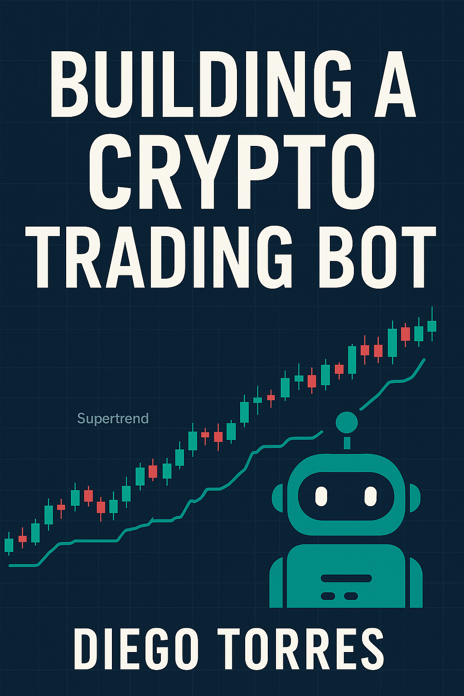

# Building A Crypto Trading Bot
## Volume 1 of the Algorithmic Trading Education Series

<p align="center">
  
</p>

This repository contains the complete source code for building a cryptocurrency trading bot using Python, Flask, and Alpaca API. The bot supports multiple trading strategies, real-time market data analysis, and automated trade execution.

## About the Book Series

This project is part of the **Algorithmic Trading Education Series** by Organica AI Solutions. The series aims to provide comprehensive, hands-on learning materials for developing automated trading systems.

### Series Volumes:
1. **Volume 1: Building A Crypto Trading Bot** (Current) - Fundamentals of crypto trading automation with Python
2. **Volume 2: Advanced Trading Strategies** (Upcoming) - Deep dive into quantitative trading models and machine learning applications
3. **Volume 3: High-Frequency Trading Systems** (Upcoming) - Building low-latency infrastructure for market making and arbitrage

Each volume includes complete source code, detailed explanations, and practical examples that readers can implement immediately.

## Features

- Multiple trading strategies (Supertrend, MACD)
- Real-time market data processing
- Automated trade execution
- Advanced risk management with position sizing
- Dynamic parameter optimization
- Performance tracking and statistics
- Multi-source data provider with fallbacks
- Web-based dashboard
- Email notifications
- Paper trading mode for testing

## Prerequisites

- Python 3.8+
- pip (Python package installer)
- Git
- Alpaca trading account (paper or live)

## Installation

1. Clone the repository:
```bash
git clone https://github.com/Organica-Ai-Solutions/BuildingACryptoTradingBot.git
cd BuildingACryptoTradingBot
```

2. Create and activate a virtual environment:
```bash
python -m venv .venv
source .venv/bin/activate  # On Windows: .venv\Scripts\activate
```

3. Install dependencies:
```bash
pip install -r requirements.txt
```

4. Create a `.env` file in the root directory and add your Alpaca API credentials:
```
ALPACA_API_KEY=your_api_key
ALPACA_API_SECRET=your_api_secret
ALPACA_API_URL=https://paper-api.alpaca.markets  # For paper trading
```

## Project Structure

```
crypto_trader/
├── backend/
│   ├── app.py                 # Main Flask application
│   ├── api_routes.py          # API endpoints
│   ├── trading_engine.py      # Trading engine implementation
│   ├── strategies/            # Trading strategies
│   │   ├── base_strategy.py
│   │   ├── supertrend_strategy.py
│   │   └── macd_strategy.py
│   └── utils/                 # Utility functions
│       ├── market_data.py
│       ├── indicators.py
│       ├── portfolio.py
│       └── notifications.py
├── frontend/
│   ├── templates/            # HTML templates
│   │   ├── dashboard.html
│   │   ├── strategies.html
│   │   ├── settings.html
│   │   └── history.html
│   └── static/              # Static assets
│       ├── css/
│       └── js/
├── tests/                   # Unit tests
├── requirements.txt         # Python dependencies
├── .env                    # Environment variables
└── README.md              # Project documentation
```

## Running the Application

1. Start the Flask application:
```bash
python -m backend.app
```

2. Open your web browser and navigate to:
```
http://localhost:5001
```

## Trading Strategies

### Supertrend Strategy
The Supertrend strategy uses a trend-following indicator that combines ATR (Average True Range) with basic price action to identify potential entry and exit points. The enhanced version includes:

- Volume confirmation for reduced false signals
- Dynamic parameter adjustment based on market volatility
- Adaptive risk-reward ratios based on market regime
- Performance tracking with automatic optimization
- Trend strength analysis for better entries

### MACD Strategy
The MACD (Moving Average Convergence Divergence) strategy uses momentum and trend following to generate trading signals based on moving average crossovers.

## Risk Management

The trading bot includes advanced risk management features:

1. **Position Sizing**: Calculates position size based on account size and defined risk percentage per trade
2. **Stop Loss Orders**: Automatically places stop loss orders based on technical levels
3. **Take Profit Orders**: Sets intelligent take profit levels with dynamic reward-risk ratios
4. **Maximum Drawdown Protection**: Monitors overall portfolio performance to prevent excessive losses
5. **Trade Frequency Limits**: Implements cooldown periods to prevent overtrading
6. **Maximum Position Size**: Limits the maximum size of any position as a percentage of portfolio

## Automated Trading

The bot includes full automation capabilities:

1. **Default Strategies**: Automatically initializes and starts trading with pre-configured strategies
2. **24/7 Operation**: Continuously monitors markets for trading opportunities
3. **Error Recovery**: Implements robust error handling and automatic recovery
4. **Performance Optimization**: Dynamically adjusts strategy parameters based on performance
5. **Multi-Symbol Trading**: Trades multiple cryptocurrencies simultaneously with batched processing

## Backtesting and Optimization

The platform includes tools for strategy development:

1. **Historical Data Backtesting**: Test strategies against historical data
2. **Parameter Optimization**: Find optimal parameters for each trading pair
3. **Performance Analytics**: Track win rate, average profit, and drawdown statistics
4. **Market Regime Detection**: Identifies trending, volatile, or ranging market conditions

## Configuration

All trading parameters can be configured through the web interface:

1. Trading Settings:
   - Paper/Live trading mode
   - Maximum concurrent trades
   - Default strategy capital
   - Risk per trade
   - Take profit/Stop loss levels

2. API Settings:
   - Alpaca API credentials
   - API endpoint URL

3. Notification Settings:
   - Email notifications
   - Trade execution alerts
   - Error notifications

## Contributing

1. Fork the repository
2. Create a feature branch
3. Commit your changes
4. Push to the branch
5. Create a Pull Request

## License

This project is licensed under the MIT License - see the LICENSE file for details.

## Disclaimer

This trading bot is for educational purposes only. Use it at your own risk. The authors and contributors are not responsible for any financial losses incurred while using this software.

## Support

For support, please open an issue in the GitHub repository or contact the maintainers directly.

## Educational Purpose

This project serves as the companion code for the book "Building A Crypto Trading Bot" (Volume 1 of the Algorithmic Trading Education Series). The book provides:

- Step-by-step explanations of all code and concepts
- Detailed tutorials on implementing and extending the trading strategies
- In-depth discussions of technical analysis principles used in the strategies
- Guidelines for proper risk management and portfolio optimization
- Best practices for deploying and maintaining automated trading systems

The book is designed for both beginners and intermediate traders/developers who want to understand how to build and deploy algorithmic trading systems. The code in this repository is fully functional and can be used as-is, but readers are encouraged to experiment with different strategies and improvements.

## How to Get the Book

The book "Building A Crypto Trading Bot" is available in:
- Digital format (PDF, EPUB, MOBI) through our [website](https://www.organicaais.com/books)
- Print format through major online retailers
- Bundle packages with additional code samples and extended analysis tools

For educational institutions interested in using this material for teaching, please contact us for special licensing arrangements.

## Acknowledgments

- Alpaca Markets for their excellent trading API
- The Python community for the amazing libraries
- All contributors and users of this project 